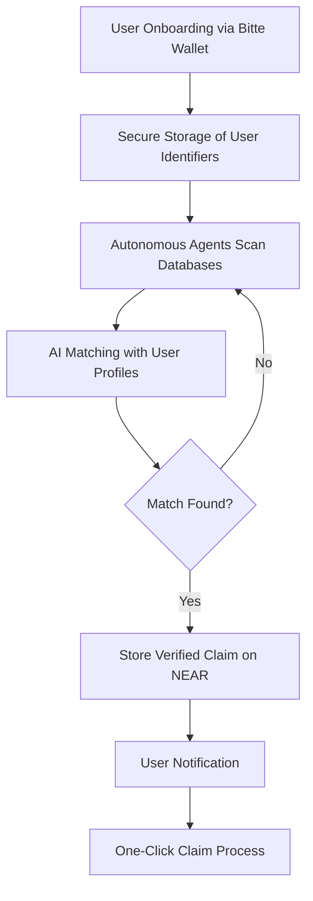

# Escheat Agents

## Overview
Escheat Agents is an autonomous platform leveraging AI agents, blockchain, and secure wallet integration to identify and recover unclaimed assets for users. It continuously scans government databases, matches unclaimed assets to user identities, and facilitates the recovery process while ensuring data security and privacy.

## Technical Foundation

### 1. Agent Framework Selection
**Primary Framework:** LangChain
- Robust support for autonomous task execution and agent memory
- Integrates well with diverse data sources and APIs
- Flexible agent design for complex workflows

_Alternative Considerations:_
- Microsoft AutoGen (for multi-agent collaboration)
- LoopGPT (lightweight task loops)
- JARVIS (multimodal processing)

### 2. Model Context Protocol (MCP) Integration
MCP will be used to standardize agent connections to government databases, ensuring:
- Seamless data access with unified interfaces
- Secure authentication and access control
- Scalable expansion to new databases

## System Architecture

### 1. Core Components

#### a. Data Collection Engine
- **Web Scraping:** Playwright-based scrapers with CAPTCHA handling
- **Data Parsing:** AI-based entity recognition and normalization

#### b. NEAR Blockchain Integration
- **Smart Contracts:** Claim registry, identity management, verification mechanisms
- **Storage:** On-chain claim verification, NEAR Blob Store for larger datasets

#### c. Bitte Wallet Integration
- **User Authentication:** MPC-secured credentials
- **User Interface:** Claim notifications, verification workflow, recovery tracking

### 2. Agent Workflow Design
1. **User Registration:** Secure credential storage in Bitte Wallet
2. **Autonomous Scanning:** LangChain-powered agents trawl government databases
3. **Matching:** AI algorithms compare user data with records
4. **Notification & Recovery:** Users receive claim alerts and guided recovery steps

## Technical Implementation

### 1. Agent Implementation with LangChain (Python)
```python
from langchain.agents import Agent, AgentExecutor, Tool
from langchain.memory import ConversationBufferMemory

class EscheatAgent:
    def __init__(self, database_target, user_identifiers):
        self.database_target = database_target
        self.user_identifiers = user_identifiers
        self.memory = ConversationBufferMemory()
        self.agent = Agent(tools=[Tool(name='database_search', func=self.search)], memory=self.memory)
    
    def scan_and_match(self):
        return self.agent.run(f"Scan {self.database_target} for matching unclaimed assets.")
```

### 2. MCP Integration (Python)
```python
class MCPDatabaseAdapter:
    def search(self, query_params):
        # Executes MCP query
        results = self.connection.query(entity_type="unclaimed_property", filters=query_params)
        return results
```

### 3. NEAR Smart Contracts (Rust)
```rust
#[near_bindgen]
#[derive(BorshDeserialize, BorshSerialize)]
pub struct EscheatRegistry {
    pub claims: LookupMap<ClaimId, Claim>,
    pub user_claims: LookupMap<AccountId, Vec<ClaimId>>,
}
```

### 4. Bitte Wallet Integration (TypeScript)
```typescript
class BitteWalletConnector {
  async notifyPotentialClaim(claimData: ClaimData): Promise<NotificationResult> {
    return this.wallet.sendNotification({
      title: 'Potential Unclaimed Asset Found',
      body: `We've found a match for $${claimData.amount}`,
      data: claimData,
    });
  }
}
```

## Development Roadmap

### **Phase 1: Foundation (Weeks 1-4)**
- Setup LangChain agents and MCP adapters
- Implement core data extraction logic

### **Phase 2: Core Functionality (Weeks 5-8)**
- Develop NEAR smart contracts
- Integrate Bitte Wallet for user authentication and notifications

### **Phase 3: Enhancement (Weeks 9-12)**
- Expand database coverage and improve agent automation
- Enhance security and privacy measures

### **Phase 4: Testing & Refinement (Weeks 13-16)**
- Performance optimization, security audits, and UX improvements

## Future Enhancements
- Multi-jurisdictional support
- Advanced document processing (OCR, AI-driven automation)
- DAO-based governance for community participation
- Mobile application for claim management

## Contact
- **Developer:** [papajams.near](https://hey.xyz/u/papajams)
- **Socials:** [Warpcast](https://warpcast.com/papa)

## Once Built

**Escheat Agents** help people reclaim billions in forgotten and unclaimed assets held by government agencies. Every year, an estimated $70 billion in unclaimed property sits in government escheat databases, with the average claim worth over $1,000. 

Our platform leverages **AI-driven web scraping**, **NEAR Protocol's blockchain infrastructure**, and **Bitte Wallet integration** to automatically identify, verify, and simplify the recovery process for these assets, returning what rightfully belongs to users.

## 🚀 Key Features

* **Autonomous Discovery** - AI agents continually scan government databases to find your unclaimed assets
* **Zero-Effort Claims** - Once identified, claims can be initiated with a single click from your wallet
* **Privacy-Preserving** - Your personal identifiers remain encrypted and secure in your Bitte Wallet
* **Real-Time Notifications** - Receive instant alerts when we find potential matches
* **On-Chain Verification** - All claims are transparently tracked and verified using NEAR Protocol

## 💻 Alternative Architecture

### System Components

1. **Data Collection Layer**
   * Web scraping agents built with Playwright/AgentQL
   * AI-powered parsing to extract and normalize records
   * Adaptive scraping to handle CAPTCHAs and site changes

2. **Blockchain Integration Layer**
   * NEAR Protocol smart contracts for secure, transparent claim verification
   * Sharded architecture (Nightshade) for scalable, low-cost storage
   * Light clients for efficient off-chain access

3. **User Interaction Layer**
   * Bitte Wallet integration with MPC-based security
   * AI-driven identity verification
   * One-click claim submission

### Workflow



## 📊 NEAR Ecosystem Benefits

* Demonstrates practical use case for blockchain in recovering real-world assets
* Showcases secure identity management through wallet integration
* Creates value for users through automated asset recovery
* Potential for community governance of disputed claims

## 📜 License

MIT © Escheat Agents

---

**Empowering people to reclaim what's rightfully theirs—seamlessly, securely, and on-chain.**
